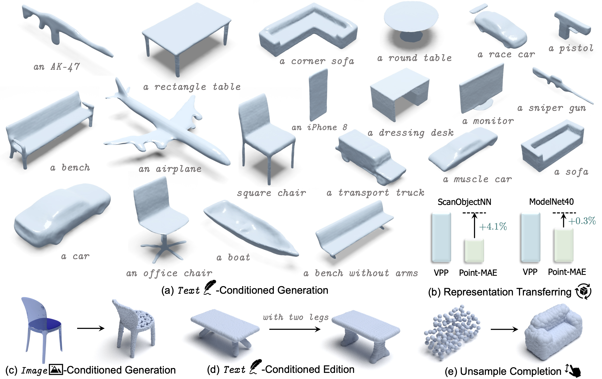

# VPP⚡

> [**VPP: Efficient Conditional 3D Generation via Voxel-Point Progressive Representation**](https://arxiv.org/abs/2307.16605), **NeurIPS 2023** <br>
> [Zekun Qi](https://scholar.google.com/citations?user=ap8yc3oAAAAJ), [Muzhou Yu](https://github.com/muzhou-yu), [Runpei Dong](https://runpeidong.com/) and [Kaisheng Ma](http://group.iiis.tsinghua.edu.cn/~maks/leader.html) <br>

[arXiv Paper](https://arxiv.org/abs/2307.16605)

## News

- 🎆 Sep, 2023: [**VPP**](https://arxiv.org/abs/2307.16605) is accepted to NeurIPS 2023.
- 💥 Aug, 2023: Check out our previous work [**ACT**](https://arxiv.org/abs/2212.08320) and [**ReCon**](https://arxiv.org/abs/2302.02318) about 3D represent learning, which have been accepted by ICLR & ICML 2023.

----


This repository contains the code release of VPP⚡: Efficient Conditional 3D Generation via Voxel-Point Progressive Representation.

<div  align="center">    
 
</div>

## 1. Requirements
PyTorch >= 1.7.0;
python >= 3.7;
CUDA >= 9.0;
GCC >= 4.9;
torchvision;

```
# Quick Start
conda create -n vpp python=3.8 -y
conda activate vpp

conda install pytorch==1.10.0 torchvision==0.11.0 cudatoolkit=11.3 -c pytorch -c nvidia
# pip install torch==1.10.0+cu113 torchvision==0.11.0+cu113 torchaudio==0.10.0+cu113 -f https://download.pytorch.org/whl/torch_stable.html
```

```
# Install basic required packages
pip install -r requirements.txt
# Chamfer Distance
cd ./extensions/chamfer_dist && python setup.py install --user

# install sap to recontruct meshes from point clouds
cd sap
cd pointnet2_ops_lib && pip install -e .
wget https://github.com/facebookresearch/pytorch3d/archive/refs/tags/v0.6.1.zip
unzip v0.6.1.zip
cd pytorch3d-0.6.1/ && pip install -e .
```

## 2. Training

### 2.1 Data Preparation
See [DATASET.md](./DATASET.md) for details.

### 2.2 Training 3D VQGAN
```
sh scripts/train_vqgan.sh <gpu_id>
```

### 2.3 Training Voxel Semantic Generator
```
sh scripts/train_voxel_generator.sh <gpu_id>
```

### 2.4 Training Grid Smoother
```
sh scripts/train_grid_smoother.sh <gpu_id>
```

### 2.5 Training Point Upsampler
```
sh scripts/train_point_upsampler.sh <gpu_id>
```

## 3. Conditional Point Clouds Generation

text prompt:
```
sh scripts/inference/text_prompt.sh <gpu_id> "a round table."
```

image prompt:
```
sh scripts/inference/image_prompt.sh <gpu_id> <img_path>
```


## 5. Reconstruction Meshes from Point Clouds
Download the [pretrained sap model](https://drive.google.com/file/d/1Ui44qxMueL21REtoeuCBwrdJPmpxegmZ/view?usp=drive_link).
```
cd sap
export CUDA_VISIBLE_DEVICES=0 && python mesh_reconstruction.py --config ../sap.json --ckpt ../sap.pkl --dataset_path ../points.npz --save_dir output/
```
The [shape as points](https://arxiv.org/abs/2106.03452) reconstruction pipeline originates from [SLIDE](https://github.com/SLIDE-3D/SLIDE), which has been trained on multi-category ShapeNet datasets with artificial noise.


## 6. Visualization
We use [PointVisualizaiton](https://github.com/qizekun/PointVisualizaiton) repo to render beautiful point cloud image, including specified color rendering and attention distribution rendering.

## Contact

If you have any questions related to the code or the paper, feel free to email Zekun (`qizekun@gmail.com`). 

## License

VPP is released under MIT License. See the [LICENSE](./LICENSE) file for more details.

## Acknowledgements

This codebase is built upon [Point-MAE](https://github.com/Pang-Yatian/Point-MAE), [CLIP](https://github.com/openai/CLIP) and [SLIDE](https://github.com/SLIDE-3D/SLIDE)

## Citation

If you find our work useful in your research, please consider citing:

```latex
@inproceedings{vpp2023,
title={{VPP}: Efficient Universal 3D Generation via Voxel-Point Progressive Representation},
author={Qi, Zekun and Yu, Muzhou and Dong, Runpei and Ma, Kaisheng},
booktitle={Thirty-seventh Conference on Neural Information Processing Systems},
year={2023},
url={https://openreview.net/forum?id=etd0ebzGOG}
}
```
